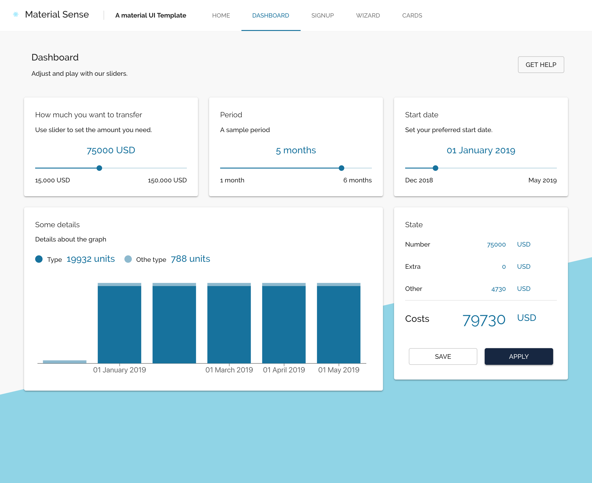

### If you're using this template, please add below your project and send a PR:
- Alexandre Magno (http://ahorta.io)
- Victoria Botelho Martins (https://contech-cbs.web.app/)

### Help to fund this project
https://opencollective.com/material-sense

#### Projects using this template:
- Ahorta Client: https://github.com/worknenjoy/ahorta-client

# React Material UI template - Material Sense
A full simple application for react [material ui](https://material-ui.com/)

## Features
- Responsive
- Include a Graph using [recharts](https://github.com/recharts/recharts)
- With [Router](https://github.com/ReactTraining/react-router) included
- A docker container for production build
- Created with [Create react app](https://github.com/facebook/create-react-app)

This project was bootstrapped with [Create React App](https://github.com/facebook/create-react-app).

## Available Scripts

In the project directory, you can run:

### `yarn start`

Runs the app in the development mode. 
Open [http://localhost:3000](http://localhost:3000) to view it in the browser.

The page will reload if you make edits. 
You will also see any lint errors in the console.

### `npm test`

Launches the test runner in the interactive watch mode. 
See the section about [running tests](https://facebook.github.io/create-react-app/docs/running-tests) for more information.

### `npm run build`

Builds the app for production to the `build` folder. 
It correctly bundles React in production mode and optimizes the build for the best performance.

The build is minified and the filenames include the hashes. 
Your app is ready to be deployed!

See the section about [deployment](https://facebook.github.io/create-react-app/docs/deployment) for more information.

### `npm run eject`

**Note: this is a one-way operation. Once you `eject`, you can’t go back!**
